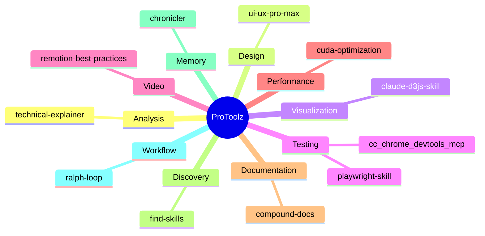

<p align="center">
  
</p>

<p align="center">
  <a href="#skills"></a>
  <a href="#agents"></a>
  <a href="#plugins"></a>
  <a href="LICENSE"></a>
</p>

<p align="center">
  <b>A curated collection of Claude Code skills, agents, and plugins for supercharging your development workflow.</b>
</p>

---

## Table of Contents

- [Overview](#overview)
- [Skills](#skills)
  - [Analysis](#analysis)
  - [Design](#design)
  - [Visualization](#visualization)
  - [Testing & Automation](#testing--automation)
  - [Performance](#performance)
  - [Documentation](#documentation)
  - [Discovery](#discovery)
- [Agents](#agents)
- [Plugins](#plugins)
- [Installation](#installation)
- [Skill Categories](#skill-categories)
- [Featured Skills](#featured-skills)
- [Usage Examples](#usage-examples)
- [Contributing](#contributing)
- [License](#license)

---

## Overview

**ProToolz** is a comprehensive collection of professional-grade tools designed to enhance Claude Code's capabilities across multiple domains:

| Domain | Tools | Purpose |
|--------|-------|---------|
| **Analysis** | technical-explainer | Deep codebase analysis & documentation |
| **Design** | ui-ux-pro-max | Complete UI/UX design system |
| **Visualization** | claude-d3js-skill | Interactive D3.js charts & diagrams |
| **Testing** | cc_chrome_devtools_mcp, playwright-skill | Browser automation & Core Web Vitals |
| **Video** | remotion-best-practices | React-based video creation |
| **Performance** | cuda-optimization | GPU/CUDA optimization for LLMs |
| **Documentation** | compound-docs | Problem-solution documentation |
| **Discovery** | find-skills | Skill marketplace discovery |
| **Memory** | chronicler | Institutional memory & logging |
| **Workflow** | ralph-loop | Iterative AI development loops |

---

## Skills

### Analysis

#### technical-explainer

> Deep-dive technical explainer for codebases

| | |
|---|---|
| **Category** | Analysis |
| **Trigger** | Explaining complex systems, codec internals, architectural patterns |
| **Output** | Interactive web apps, markdown docs, annotated source tours |

**Key Features:**
- Analyzes actual source code (not just docs)
- Multi-level depth calibration (L1-L5)
- Three visual themes: Light, Academic, Dark
- Side-by-side comparisons
- Data flow visualization

```
Use for: codec/serialization systems, compiler internals,
ML pipelines, distributed systems
```

---

### Design

#### ui-ux-pro-max

> UI/UX design intelligence with 50+ styles & 9 technology stacks

| | |
|---|---|
| **Category** | Design |
| **Stacks** | React, Next.js, Vue, Svelte, SwiftUI, React Native, Flutter, Tailwind, shadcn/ui |
| **Styles** | Glassmorphism, Claymorphism, Minimalism, Brutalism, Neumorphism, Bento Grid |

**What's Included:**
- 50 UI styles with CSS implementations
- 21 color palettes by product type
- 50 font pairings from Google Fonts
- 20 chart recommendations
- 99 UX guidelines with priority ranking

```bash
# Generate a complete design system
python3 skills/ui-ux-pro-max/scripts/search.py "saas dashboard modern" --design-system
```

---

### Visualization

#### claude-d3js-skill

> Interactive data visualizations using D3.js

| | |
|---|---|
| **Category** | Visualization |
| **Frameworks** | Vanilla JS, React, Vue, Svelte |
| **Charts** | Bar, Line, Scatter, Pie, Chord, Heatmap, Force-directed networks |

**Capabilities:**
- Custom chart creation beyond standard libraries
- Network/graph visualizations
- Geographic projections
- Smooth transitions & animations
- Responsive sizing
- Accessibility support

---

### Testing & Automation

#### cc_chrome_devtools_mcp

> Chrome DevTools automation via MCP

| | |
|---|---|
| **Category** | Testing |
| **Protocol** | Chrome DevTools Protocol (CDP) |
| **Tools** | 27 professional-grade testing tools |

**Core Web Vitals Support:**
- INP (Interaction to Next Paint) ≤ 200ms
- LCP (Largest Contentful Paint) ≤ 2.5s
- CLS (Cumulative Layout Shift) ≤ 0.1

**Workflows:**
- Performance tracing
- Network monitoring & HAR export
- Accessibility tree inspection
- Device emulation
- Multi-tab management

---

#### playwright-skill

> Complete browser automation with Playwright

| | |
|---|---|
| **Category** | Automation |
| **Output** | Clean test scripts to `/tmp` |
| **Features** | Auto-detects dev servers, responsive testing |

**Use Cases:**
- E2E testing
- Form validation
- Screenshot capture
- Login flow testing
- Link validation
- Visual regression testing

---

### Video

#### remotion-best-practices

> Video creation in React

| | |
|---|---|
| **Category** | Video |
| **Framework** | Remotion |
| **Topics** | 3D, Animations, Audio, Assets, Compositions |

Best practices for building programmatic videos with React components.

---

### Performance

#### cuda-optimization

> CUDA optimization for LLM inference

| | |
|---|---|
| **Category** | Performance |
| **Focus** | Transformer/LLM runtimes |
| **Targets** | Atlas, vLLM, ExLlama, Ollama-like systems |

**Optimization Areas:**
- Attention + KV cache
- GEMM/tensor cores
- Quantization paths (INT4/INT8)
- Kernel fusion
- Launch overhead
- VRAM/fragmentation

**Metrics:**
- Decode latency (ms/token)
- Prefill throughput (tokens/s)
- VRAM footprint

---

### Documentation

#### compound-docs

> Problem-solution documentation system

| | |
|---|---|
| **Category** | Documentation |
| **Format** | YAML frontmatter + Markdown |
| **Organization** | Category-based directories |

**Auto-triggers on:**
- "that worked"
- "it's fixed"
- "working now"

Creates searchable institutional knowledge with:
- Exact error messages
- Investigation attempts
- Root cause analysis
- Prevention guidance
- Cross-references

---

### Discovery

#### find-skills

> Skill marketplace discovery

| | |
|---|---|
| **Category** | Discovery |
| **Triggers** | "how do I...", "find a skill for...", "is there a skill that..." |

Helps discover and install additional Claude Code skills from the marketplace.

---

## Agents

### chronicler

> Institutional memory agent

| | |
|---|---|
| **Type** | Agent |
| **Model** | Opus |
| **Purpose** | Record, preserve, and narrate work evolution |

**Operating Modes:**

| Mode | Use Case |
|------|----------|
| **Daily Log** | End-of-day development activity capture |
| **Narrative** | Sprint summaries, retrospectives |
| **Project Chronicle** | Comprehensive project documentation for handoffs |

**Sources of Truth:**
- Git commits & diffs
- File metadata
- Markdown notes
- Design docs, specs, TODOs
- Issue trackers / PRs

> "If there is a conflict between memory and evidence, **evidence wins**."

---

## Plugins

### ralph-loop

> Iterative AI development loops

| | |
|---|---|
| **Type** | Plugin |
| **Technique** | Ralph Wiggum coding methodology |
| **Mechanism** | Stop hook intercepts exit, feeds same prompt |

**How it Works:**

```bash
/ralph-loop "Build a REST API for todos" --completion-promise "COMPLETE" --max-iterations 50
```

1. Claude works on task
2. Tries to exit
3. Stop hook blocks exit
4. Same prompt fed back
5. Repeat until completion promise detected

Creates a **self-referential feedback loop** where each iteration sees modified files and git history.

---

## Installation

### Quick Install

```bash
# Clone the repository
git clone https://github.com/yourusername/ProToolz.git ~/.claude/skills/ProToolz

# Or copy individual skills
cp -r ProToolz/skills/ui-ux-pro-max ~/.claude/skills/
```

### Skill Structure

```
~/.claude/skills/
├── technical-explainer/
├── ui-ux-pro-max/
├── claude-d3js-skill/
├── cc_chrome_devtools_mcp/
├── playwright-skill/
├── remotion-best-practices/
├── cuda-optimization/
├── compound-docs/
└── find-skills/

~/.claude/agents/
└── chronicler.md

~/.claude/plugins/
└── ralph-loop/
```

### MCP Server Setup (for Chrome DevTools)

```json
{
  "mcpServers": {
    "chrome-devtools": {
      "command": "npx",
      "args": [
        "chrome-devtools-mcp@latest",
        "--isolated=true",
        "--viewport=1920x1080"
      ]
    }
  }
}
```

---

## Skill Categories



---

## Featured Skills

<details>
<summary><b>technical-explainer</b> - Deep Codebase Analysis</summary>

### Philosophy

**Code is the truth. Docs lie.**

1. Always read source code before writing explanations
2. Determine explanation depth based on complexity, not word count
3. Show actual code snippets with inline annotations
4. Explain the "why" behind design decisions
5. Surface trade-offs explicitly

### Depth Levels

| Level | When to Use | Content |
|-------|-------------|---------|
| **L1: Glance** | Trivial/obvious code | 1-2 sentences, no code |
| **L2: Summary** | Standard patterns | Purpose + key types + 1 snippet |
| **L3: Walkthrough** | Important but conventional | Full API + 2-3 snippets + trade-offs |
| **L4: Deep Dive** | Novel/complex/critical | Everything: algorithm, memory, perf |
| **L5: Archaeology** | Confusing/surprising | Git blame, commit history, "why?" |

### Output Formats

- **Interactive Web App** (Vite + React)
- **Markdown Document**
- **Annotated Source Tour**

</details>

<details>
<summary><b>ui-ux-pro-max</b> - Design Intelligence</summary>

### Quick Reference

```bash
# Generate complete design system
python3 skills/ui-ux-pro-max/scripts/search.py "beauty spa wellness" --design-system

# Search specific domain
python3 skills/ui-ux-pro-max/scripts/search.py "glassmorphism" --domain style

# Get stack-specific guidelines
python3 skills/ui-ux-pro-max/scripts/search.py "responsive forms" --stack html-tailwind
```

### Available Domains

| Domain | Use For |
|--------|---------|
| `product` | Product type recommendations |
| `style` | UI styles, colors, effects |
| `typography` | Font pairings |
| `color` | Color palettes by product type |
| `landing` | Page structure, CTA strategies |
| `chart` | Chart types |
| `ux` | Best practices, anti-patterns |

### Pre-Delivery Checklist

- [ ] No emojis used as icons (use SVG)
- [ ] All clickable elements have `cursor-pointer`
- [ ] Light/dark mode contrast verified
- [ ] Responsive at 375px, 768px, 1024px, 1440px
- [ ] `prefers-reduced-motion` respected

</details>

<details>
<summary><b>cuda-optimization</b> - LLM Inference Performance</summary>

### Optimization Loop

1. **Establish baseline** - Fixed prompt/seed/config, record metrics
2. **Classify bottleneck** - Bandwidth/Compute/Launch/Occupancy/Layout
3. **Profile** - Nsight Systems (gaps, syncs) → Nsight Compute (memory, occupancy)
4. **Apply fixes** - Highest leverage first
5. **Verify** - Correctness + performance tests

### Bottleneck Categories

| Type | Symptoms | Key Fixes |
|------|----------|-----------|
| **Bandwidth** | KV reads, decode attention | Coalesced loads, vectorize |
| **Compute** | GEMMs, prefill attention | Tensor cores, cuBLASLt |
| **Launch** | Many tiny kernels, idle gaps | CUDA Graphs, kernel fusion |
| **Occupancy** | Low SM utilization | Reduce registers/shared memory |

### Correctness Toolkit

```bash
compute-sanitizer --tool memcheck  # OOB/illegal
compute-sanitizer --tool racecheck # Races
compute-sanitizer --tool initcheck # Uninitialized
```

</details>

---

## Usage Examples

### Analyze a Codebase

```
User: Explain how this codec works
Assistant: [Uses technical-explainer skill to analyze source code,
            generate architecture diagrams, and create annotated documentation]
```

### Design a Dashboard

```
User: Design a SaaS analytics dashboard
Assistant: [Uses ui-ux-pro-max to generate design system with color palette,
            typography, component styles, and accessibility guidelines]
```

### Test Web Performance

```
User: Check the Core Web Vitals for my site
Assistant: [Uses cc_chrome_devtools_mcp to run performance traces,
            measure INP/LCP/CLS, and provide optimization recommendations]
```

### Create Data Visualization

```
User: Create an interactive network diagram
Assistant: [Uses claude-d3js-skill to build force-directed graph
            with zoom, pan, tooltips, and smooth transitions]
```

### Optimize CUDA Kernels

```
User: My LLM inference is slow at batch=1
Assistant: [Uses cuda-optimization to diagnose decode latency issues,
            profile with Nsight, and recommend KV cache optimizations]
```

### Document a Fix

```
User: That worked! The N+1 query is fixed.
Assistant: [Uses compound-docs to capture the solution with YAML frontmatter,
            root cause analysis, and prevention guidance]
```

### Iterate on Complex Tasks

```
User: /ralph-loop "Build a complete REST API with tests" --max-iterations 50
Assistant: [Ralph loop iterates, tests, fixes, until completion promise detected]
```

---

## Contributing

Contributions are welcome! To add a new skill:

1. Create a new directory under `skills/`
2. Add a `SKILL.md` with YAML frontmatter:
   ```yaml
   ---
   name: your-skill-name
   description: Brief description of what the skill does
   ---
   ```
3. Include any reference files in `references/`
4. Add scripts in `scripts/` if applicable
5. Update this README with skill documentation

---

## License

MIT License - see [LICENSE](LICENSE) for details.

---

<p align="center">
  <sub>Built with Claude Code</sub>
</p>
